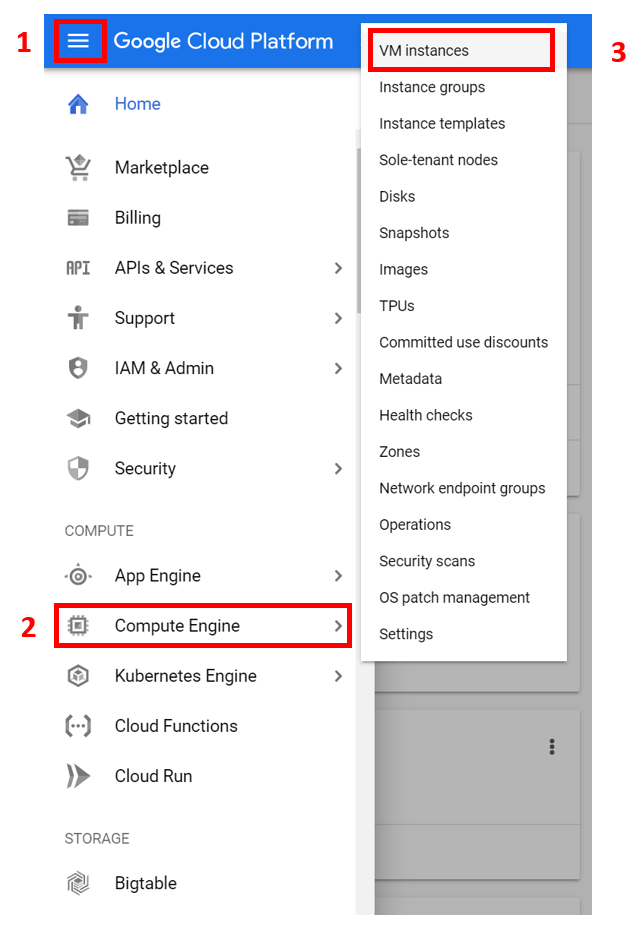
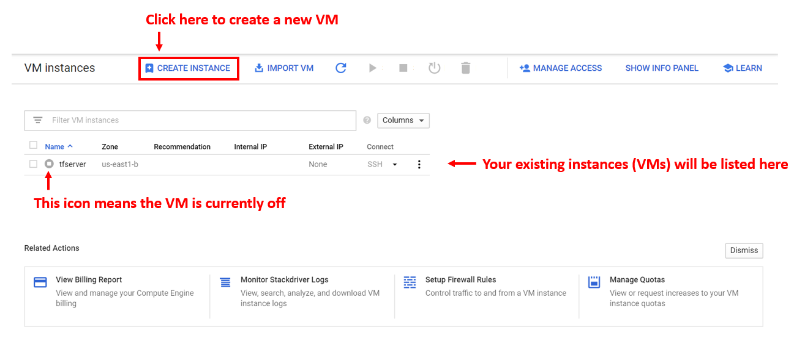
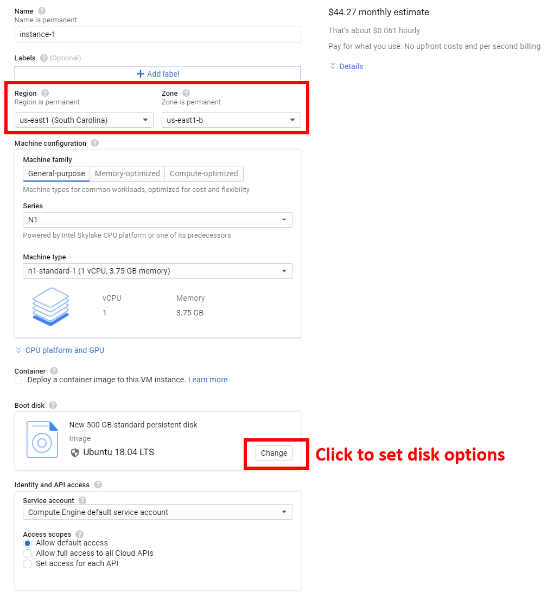
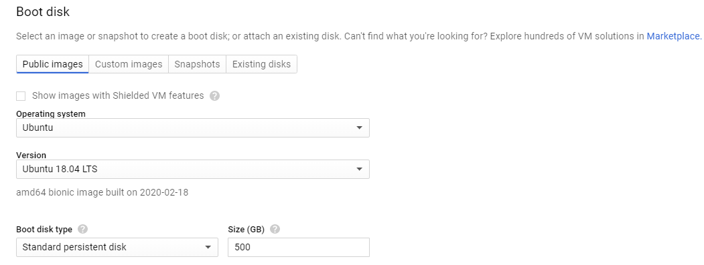
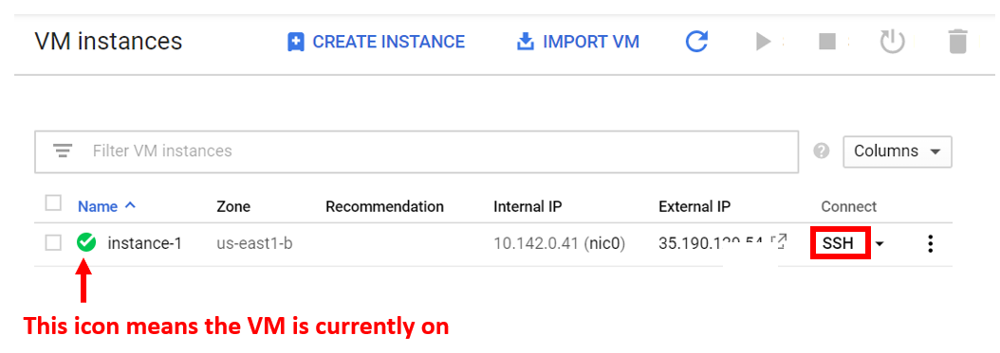
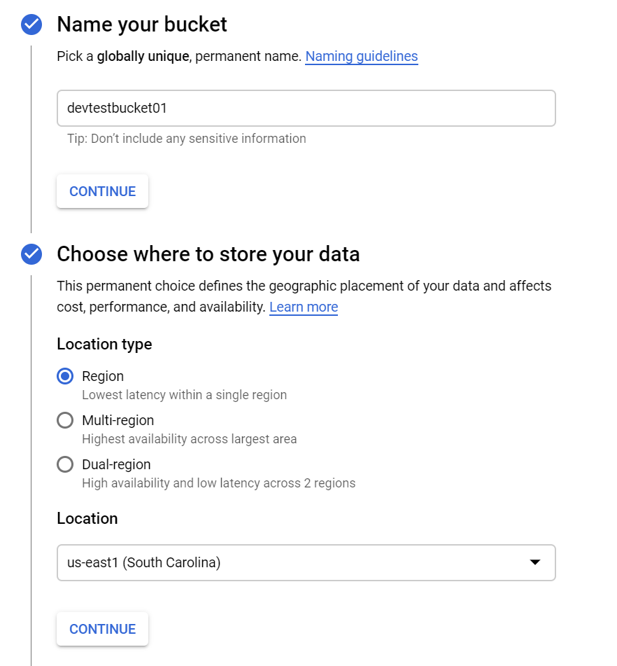

# Intro
These are a collection of scripts and instructions to leverage cloud computing platforms for NGS analysis (like RNA-seq) to generate raw read counts that can then be used to perform DGE analysis in [BEAVR](https://github.com/developerpiru/BEAVR).

The instructions provided here are for the Google Cloud Platform. If you don't have an account yet, you can [sign up for a free trial](https://cloud.google.com/free) where you will get $300 USD ($400 CAD) for 1 year. A future update to these instructions will provide instructions for Amazon's AWS and perhaps even Microsoft Azure. For now, if you are using AWS or Azure, setup a fresh compute unit running Ubuntu 18.04 LTS and you can skip ahead to installing [Miniconda](https://github.com/developerpiru/cloudservers#install-miniconda).

If you are going to perform alignments on a local server/computer that is running Linux or Mac OS, skip ahead to installing [Miniconda](https://github.com/developerpiru/cloudservers#install-miniconda).

---

## Table of contents

+ [Cloud platforms](https://github.com/developerpiru/cloudservers#cloud-platforms)

  + [Google Cloud Platform (GCP)](https://github.com/developerpiru/cloudservers#google-cloud-platform-gcp)
    + [Getting started with GCP](https://github.com/developerpiru/cloudservers#getting-started-with-gcp)
    + [Creating a new compute instance](https://github.com/developerpiru/cloudservers#creating-a-new-compute-instance)
    + [Creating a storage bucket](https://github.com/developerpiru/cloudservers#creating-a-storage-bucket)
    + [How to setup a newly created VM](https://github.com/developerpiru/cloudservers#how-to-setup-a-newly-created-vm)
      + [Setting up GCSFuse](https://github.com/developerpiru/cloudservers#setting-up-gcsfuse)
      + [Install Miniconda](https://github.com/developerpiru/cloudservers#install-miniconda)
      + [Install Basemount](https://github.com/developerpiru/cloudservers#installing-basemount)
    + [Install VNC server on your VM](https://github.com/developerpiru/cloudservers#install-vnc-server)
      + [Automatically install VNC server on Ubuntu](https://github.com/developerpiru/cloudservers#automatically-install-vnc-server-on-ubuntu)
      + [Install VNC client on your local computer](https://github.com/developerpiru/cloudservers#install-vnc-client-on-your-local-computer)
      + [Connecting to VNC server on remote server](https://github.com/developerpiru/cloudservers#connecting-to-vnc-server-on-remote-server)
      + [Stopping the VNC server](https://github.com/developerpiru/cloudservers#stopping-the-vnc-server)
    + [Getting raw read counts with your VM](https://github.com/developerpiru/cloudservers#rna-seq-analysis-with-your-vm)     
      + [Setting up STAR aligner](https://github.com/developerpiru/cloudservers#setting-up-star-aligner)
      + [Preparing your read files](https://github.com/developerpiru/cloudservers#preparing-your-read-files)
      + [Get read counts with STAR](https://github.com/developerpiru/cloudservers#get-read-counts-with-star)
   + [Analyzing your raw read counts with BEAVR](https://github.com/developerpiru/cloudservers#analyzing-your-raw-read-counts-with-beavr)

---

## Cloud platforms

### Google Cloud Platform (GCP)

Create a Google account if you don't already have one and then go to https://console.cloud.google.com/ to setup your cloud account. 

## Getting started with GCP

### Creating a new compute instance

1. From the [GCP Dashboard](https://console.cloud.google.com/home/dashboard), click on the menu button (1), then hover over **Computer Engine** to display the pop-up menu (2), then click on **VM instances** (3)
  
  
2. This is where all of your existing VMs will be listed. To create a new VM, click **Create Instance** at the top.
  

3. The page will ask you to specify details for your new VM instance. Notice the cost right. The montly cost is the cost you will incur if you run the VM 24/7. You won't be doing this for analysis purposes; you will only run it for a few hours so only pay attention to the hourly cost which is 6.1 cents/hour for the default configuration shown here. The more powerful your VM, the faster tasks will finish (generally speaking), so in some situations it would make sense to get a more expensive hourly VM. 

  You need to specify these details:
  + Instance name
  + Region and zone: Select **us-east1** for Region because it is closest to you and the cheapest cost.
  + Machine configuration: select a prebuilt configuration or customize your own CPU and memory allotment. 
  + Click the **Change** button under **Boot disk** to specify the hard drive and OS configuration.

    + Select Ubuntu for the **Operating system**
    + Select Ubuntu 18.04 LTS for **Version**
    + Set the size for 500 GB
  + Under **Identity and API access**, select **Allow full access to all Cloud APIs**
  + Under **Firewall**, select **Allow HTTP traffic** and **Allow HTTPS traffic**
  + Click the **Create** button at the button when you are done.

4. This will return you to the **VM instances** page where you will see your newly created instance. The green icon indicates the VM is currently running.


5. To connect to the VM, click on the **SSH** button (after ensuring it is on). You can use the menu button to Start, Stop, Reset, or Delete a VM.

---
### Creating a storage bucket

Think of a storage bucket as a cloud storage drive where you can save your files. You can use it as a shared folder to transfer files to and from your local computer to a VM. 

1. From the [GCP Dashboard](https://console.cloud.google.com/home/dashboard), click on the menu button, then click on **Storage**. 

2. This will open the storage browser and list any buckets you have (similar to the VM Instances page. Click **Create Bucket** at the top.

3. This will open a new page where you must enter details for your new bucket.



  + You must specify a globally unique name (meaning the name must not be taken by anyone else)
  + For **Location type**, select Region
  + For **Location**, select the **same region as the VM instances you have created!**
  + Leave all other settings as defaults and click **Create** at the bottom.

4. Your newly created bucket will be listed. Click on its name to view its contents (which will be empty right now).

5. You can upload files by using the buttons provided or by dragging files into the browser from your computer.

---
### How to setup a newly created VM

#### Setting up GCSFuse
A newly created VM only has a basic install of Ubuntu and you must now install any software you need. 

The first step is to install [gcsfuse](https://github.com/GoogleCloudPlatform/gcsfuse) on your new VM. Gcsfuse allows you to connect your VM to a storage bucket you own. This will "mount" your storage bucket as a virtual drive in your VM so you can transfer files to and from it. 

Copy and paste these commands to setup gcsfuse:
  ```
  #install gcsfuse
  export GCSFUSE_REPO=gcsfuse-`lsb_release -c -s`
  echo "deb http://packages.cloud.google.com/apt $GCSFUSE_REPO main" | sudo tee /etc/apt/sources.list.d/gcsfuse.list
  curl https://packages.cloud.google.com/apt/doc/apt-key.gpg | sudo apt-key add -
  sudo apt-get update
  sudo apt-get install gcsfuse
  #create folder for mounting
  mkdir mountfolder
  ```

You now have gcsfuse installed and have created a folder called "mountfolder". This is where you will mount your storage bucket.

Enter this command to mount your storage bucket:
  ```
  gcsfuse myBucketName mountfolder
  ```
  Where ```myBucketName``` is the name of the storage bucket you created.

---
#### Install Miniconda

Miniconda is required to download and install some bioinformatics tools. You can install it using these commands:
  ```
  #download setup install script
  wget https://repo.anaconda.com/miniconda/Miniconda3-latest-Linux-x86_64.sh
  #run setup
  bash Miniconda3-latest-Linux-x86_64.sh
  ```
  Then follow the prompts to complete installation.
  
You may have to open a new terminal window in order for the ```conda``` command to be recognized.

Try entering this command:
  ```
  conda --version
  ```
  You should see the version number of conda if it installed correctly.

---
#### Installing Basemount

Like gcsfuse, basemount has their own software to let you interface with your basepsace account. This will allow you to mount your basespace account as a virtual drive and transfer your read files.

Enter these commands to install basemount:
  ```
  #install basemount
  sudo bash -c "$(curl -L https://basemount.basespace.illumina.com/install)"
  #create folder for mounting
  mkdir basemountfolder
  ```
  
You now have basemount installed and have created a folder called "basemountfolder". This is where you will mount your basemount account.

Enter this command to mount your storage bucket:
  ```
  basemount basemountfolder
  ```
  You will now be prompted to login to your basespace account and once you do, you can access your files.

---
### Install VNC server

You may also wish to have  graphical user interface (GUI) desktop for your server instead of a command-line only ssh terminal interface. To do this, you must install a VNC (virtual network computing) server that will allow you to remotely connect to a desktop. You must also install a desktop environment on your Linux VM because one is not installed by default.

#### Automatically install VNC server on Ubuntu

A script is provided to setup a VNC server and automatically configure it. Download the required files from here: 

1. Download the setup files here: https://github.com/developerpiru/cloudservers/blob/master/VNC-setup.tar.gz
2. Copy this to your storage bucket that you created above
3. Mount your storage bucket with gcsfuse if you haven't done so already:
  ```
  gcsfuse myBucketName mountfolder
  ```
4. Navigate to where you copied vnc-setup.zip in your storage bucket
  ```
  cd mountfolder/path/to/where/you/saved/the/file
  ```
5. Extract the VNC-setup.tar.gz archive
	```
	tar -xzvf VNC-setup.tar.gz
	```
6. Change directories into the newly extracted folder
	```
	cd VNC-setup
	```
7. Run the script:
	```
	bash vnc-setup.sh
	```
---	
#### Install VNC client on your local computer

You need a VNC client to connect to the VNC server you just setup on your VM. 

You can install either PuTTY for Windows (https://www.chiark.greenend.org.uk/~sgtatham/putty/latest.html) or RealVNC's VNC Viewer for Windows, Mac OS, or Linux (https://www.realvnc.com/en/connect/download/viewer/)

See below for instructions on how to connect to your remote server.

---
#### Connecting to VNC server on remote server
1. On your VM, start the VNC server with this command:
	```
	vncserver -geometry 1200x1050
	```
	**Note:** the `-geometry 1200x1050` flag is optional and you can customize it to any resolution you prefer

2. Open your VNC client (PuTTY or VNC Viewer) and enter the **external IP address** (not its local IP!) of your remote computer followed by the `:5901` port. For example: `192.0.2.0:5901`. You can find the external IP address of your VM by looking at your [VM instances list](https://console.cloud.google.com/compute/instances).
	
3. Enter the password you created earlier when you ran the vnc-setup.sh script.

4. If prompted, select to use the default desktop configuration.

You should now see the Ubuntu desktop now and be able to interact with the GUI using your mouse and keyboard. 

**Note:** to help you with downloading any other required components, it is recommended that you install Chrome or Firefox on your Linux VM:

Chrome:
	
	wget https://dl.google.com/linux/direct/google-chrome-stable_current_amd64.deb
	sudo dpkg -i google-chrome-stable_current_amd64.deb
	
	
Firefox:
	
	sudo apt-get update
	sudo apt-get install firefox
	

#### Stopping the VNC server
You can stop the VNC server by entering this command in a terminal on your VM:
	
	vncserver -kill :1
	
---


## Getting raw read counts with your VM

### Setting up STAR aligner

Once you have the basics setup, you can begin your RNA-seq analysis. 

First you need to install STAR aligner. 
  ```
  #add repository channels to conda
  conda config --add channels defaults
  conda config --add channels bioconda
  conda config --add channels conda-forge
  #install STAR
  conda install STAR
  ```

Then you need to download some required reference files in order to build a reference genome for your organism of interest (e.g. human, mouse)

Make a new directory to store these files and move into that folder:
  ```
  cd $HOME
  #create folder for genome files
  mkdir STARgenomefiles
  cd STARgenomefiles
  ```

First, you need a "primary assembly file" in FASTA format. You can access it here: [ftp://ftp.ensembl.org/pub/](ftp://ftp.ensembl.org/pub/)
Look for the latest release, e.g. for humans: [ftp://ftp.ensembl.org/pub/release-99/fasta/homo_sapiens/dna/](ftp://ftp.ensembl.org/pub/release-99/fasta/homo_sapiens/dna/)
Download the full assembly [ftp://ftp.ensembl.org/pub/release-99/fasta/homo_sapiens/dna/Homo_sapiens.GRCh38.dna.primary_assembly.fa.gz](ftp://ftp.ensembl.org/pub/release-99/fasta/homo_sapiens/dna/Homo_sapiens.GRCh38.dna.primary_assembly.fa.gz) or only download the region of interest depending on your experiment. 

  ```
  wget ftp://ftp.ensembl.org/pub/release-99/fasta/homo_sapiens/dna/Homo_sapiens.GRCh38.dna.primary_assembly.fa.gz
  gunzip -k Homo_sapiens.GRCh38.dna.primary_assembly.fa.gz
  ```
  This may take a while.

Second, you need a gtf which holds gene structure information. Make sure the release version is the same as your primary assembly file above. You can access release 99 for the human genome here: [ftp://ftp.ensembl.org/pub/release-99/gtf/homo_sapiens/Homo_sapiens.GRCh38.99.gtf.gz](ftp://ftp.ensembl.org/pub/release-99/gtf/homo_sapiens/Homo_sapiens.GRCh38.99.gtf.gz)

  ```
  wget ftp://ftp.ensembl.org/pub/release-99/gtf/homo_sapiens/Homo_sapiens.GRCh38.99.gtf.gz
  gunzip -k Homo_sapiens.GRCh38.99.gtf.gz
  ```

Now make a new folder in your home directory to store the generated reference genome:
  ```
  cd $HOME
  mkdir STARgenome
  ```

Now you can enter the command to generate the genome:
  ```
  STAR --runThreadN 64 --runMode genomeGenerate --genomeDir $HOME/STARgenome --genomeFastaFiles $HOME/STARgenomefiles/Homo_sapiens.GRCh38.dna.primary_assembly.fa --sjdbGTFfile $HOME/STARgenomefiles/Homo_sapiens.GRCh38.99.gtf --sjdbOverhang 100
  ```
  Where ```--runThreadN 64``` specificies the number of CPU threads you want to use (general rule is CPU cores x2 or CPU cores x4)
  
This will take a while to generate.

---
### Preparing your read files

Create a new folder to store your downloaded fastq files
  ```
  cd $HOME
  mkdir myfastqfiles
  ```

Mount your basemount folder and download your files to your VM:
  ```
  basemount basemountfolder
  ```
  Now you can access your basespace projects, samples, and files from the ```basemountfolder``` folder.

Look for files with the format ```.gz``` within the Files directory for each sample within a project. If you are using the default terminal interface for GCP, these filenames will be highlighted in a red font.
You can copy the files from basespace to the folder you created like so:
  ```
  cp [name-of-file].gz $HOME/myfastqfiles
  ```

**Note:** That command will copy files one at a time by name. Alternatively, you can use this command to copy all relevant files from one Sample/Files directory:
  ```
  cp *.gz $HOME/myfastqfiles
  ```

Once you have downloaded your files, extract them:
  ```
  cd $HOME/myfastqfiles
  gunzip -k *.gz
  ```

Then you need to concatenate files run in different lanes for the same sample. You can use wildcards like this:
  ```
  cat WTA-1*.fastq > WTA-1.fastq
  cat WTA-2*.fastq > WTA-2.fastq
  cat WTA-3*.fastq > WTA-3.fastq
  
  cat KO4A-1*.fastq > KO4A-1.fastq
  cat KO4A-2*.fastq > KO4A-2.fastq
  cat KO4A-3*.fastq > KO4A-3.fastq
  ```

---
### Get read counts with STAR

Make a new directory to store your output files:
  ```
  cd $HOME
  mkdir readcounts
  ```

You can run this command to start alignments and generating read counts with STAR. Modify these parameters for your experiment:
  + This example shows how to do this for 6 samples with fastq files named: ```WTA-1.fastq```, ```WTA-2.fastq```, ```WTA-3.fastq```, ```KOA-1.fastq```, ```KOA-2.fastq```, ```KOA-3.fastq```. 
  + The fastq files are stored in ```$HOME/myfastqfiles``` which is specified with ```--readFilesIn```.
  + The location of the genome you generated is specified by ```--genomeDir```
  + The location of the gtf file you downloaded is specififed by ```--sjdbGTFfile```
  + The output location and filename prefix is specified by ```--outFileNamePrefix```

```
#WTA-1.fastq:
STAR --runThreadN 96 --genomeDir $HOME/STARgenome --readFilesIn $HOME/myfastqfiles/WTA-1.fastq --sjdbGTFfile $HOME/STARgenomefiles/Homo_sapiens.GRCh38.92.gtf --sjdbOverhang 100 --quantMode TranscriptomeSAM GeneCounts --outFileNamePrefix $HOME/readcounts/WTA-1 --genomeLoad LoadAndKeep

#WTA-2.fastq:
STAR --runThreadN 96 --genomeDir $HOME/STARgenome --readFilesIn $HOME/myfastqfiles/WTA-2.fastq --sjdbGTFfile $HOME/STARgenomefiles/Homo_sapiens.GRCh38.92.gtf --sjdbOverhang 100 --quantMode TranscriptomeSAM GeneCounts --outFileNamePrefix $HOME/readcounts/WTA-2

#WTA-3.fastq:
STAR --runThreadN 96 --genomeDir $HOME/STARgenome --readFilesIn $HOME/myfastqfiles/WTA-3.fastq --sjdbGTFfile $HOME/STARgenomefiles/Homo_sapiens.GRCh38.92.gtf --sjdbOverhang 100 --quantMode TranscriptomeSAM GeneCounts --outFileNamePrefix $HOME/readcounts/WTA-3

#KO4A-1.fastq:
STAR --runThreadN 96 --genomeDir $HOME/STARgenome --readFilesIn $HOME/myfastqfiles/KO4A-1.fastq --sjdbGTFfile $HOME/STARgenomefiles/Homo_sapiens.GRCh38.92.gtf --sjdbOverhang 100 --quantMode TranscriptomeSAM GeneCounts --outFileNamePrefix $HOME/readcounts/KO4A-1

#KO4A-2.fastq:
STAR --runThreadN 96 --genomeDir $HOME/STARgenome --readFilesIn $HOME/myfastqfiles/KO4A-2.fastq --sjdbGTFfile $HOME/STARgenomefiles/Homo_sapiens.GRCh38.92.gtf --sjdbOverhang 100 --quantMode TranscriptomeSAM GeneCounts --outFileNamePrefix $HOME/readcounts/KO4A-2

#KO4A-3.fastq:
STAR --runThreadN 96 --genomeDir $HOME/STARgenome --readFilesIn $HOME/myfastqfiles/KO4A-3.fastq --sjdbGTFfile $HOME/STARgenomefiles/Homo_sapiens.GRCh38.92.gtf --sjdbOverhang 100 --quantMode TranscriptomeSAM GeneCounts --outFileNamePrefix $HOME/readcounts/KO4A-3
```

Once the alignments finish, transfer your files from your output folder to your storage bucket:
  ```
  cp $HOME/readcounts* $HOME/mountfolder
  ```
  
You must also transfer any other files that you wish to download to your local computer. 

You can then access your storage bucket (your cloud storage) by visiting the [Storage browser page](https://console.cloud.google.com/storage/browser) from your personal/local computer and download your files.


---


## Analyzing your raw read counts with BEAVR

Once you've downloaded your raw read files, you're ready to analyze the raw read counts and compute differentially expressed genes (DGE) using [BEAVR](https://github.com/developerpiru/BEAVR). BEAVR (Browser-based Exploration and Visualization of RNA-seq data) will automatically run DESeq2 analysis and provides an interactive environment for you to generate figures. 

Whereas computuing raw read counts requires intensive computing power, calculating DGE does not. You can run BEAVR locally on your personal or a local computer, or you can optionally run it on your cloud server. Instructions to do either are provided on the [GitHub page](https://github.com/developerpiru/BEAVR) page, including how to create a shared cloud/local BEAVR server to share with multiple simultaneous users in your research group.

The full documentation and tutorial for BEAVR is on the [GitHub page](https://github.com/developerpiru/BEAVR).
